BIG IQ 5.4 Self Guided Lab Guide

Participant Hands-on Lab Guide

Version: 2.0

|image0|

    Last Updated: 3/5/2018

©2018 F5 Networks, Inc. All rights reserved. F5, F5 Networks, and the F5
logo are trademarks of F5 Networks, Inc. in the U.S. and in certain
other countries. Other F5 trademarks are identified at f5.com.

Any other products, services, or company names referenced herein may be
trademarks of their respective owners with no endorsement or
affiliation, express or implied, claimed by F5.

These training materials and documentation are F5 Confidential
Information and are subject to the F5 Networks Reseller Agreement. You
may not share these training materials and documentation with any third
party without the express written permission of F5.

`Overview 4 <#_Toc518815019>`__

`Introduction 4 <#_Toc518815020>`__

`Device Information 5 <#device-information>`__

`Dependencies 6 <#dependencies>`__

`How to access the lab in the Ravello environment 7 <#_Toc518815023>`__

`The BIG-IQ User Interface 7 <#_Toc518815024>`__

`Note: 10 <#note>`__

`BIG-IQ Access Policy Manager 11 <#big-iq-access-policy-manager>`__

`WORKFLOW 1: Access Policy Review
11 <#workflow-1-access-policy-review>`__

`WORKFLOW 2: Location Specific Object Modification
12 <#workflow-2-location-specific-object-modification>`__

`WORKFLOW 3: Modifying an existing APM access policy using VPE
14 <#workflow-3-modifying-an-existing-apm-access-policy-using-vpe>`__

`WORKFLOW 4: Create a new VPN Access profile
19 <#workflow-4-create-a-new-vpn-access-profile>`__

`WORKFLOW 5: View APM Audit logs and Dashboards 26 <#_Toc518815031>`__

`BIG-IQ Device Management 33 <#big-iq-device-management>`__

`WORKFLOW 1: Setting up of BIG-IQ Data Collection Devices (DCD).
(REQUIRED)
33 <#workflow-1-removing-previously-discovered-devices-for-this-lab-exercise>`__

`WORKFLOW 2: Importing BIG-IP devices for management and inventory
(REQUIRED) 36 <#_Toc518815034>`__

`WORKFLOW 5: Automating device backups and archiving a copy of the
backup file 44 <#_Toc518815035>`__

`WORKFLOW 6: Uploading QKviews to iHealth for a support case
47 <#_Toc518815036>`__

`BIG-IQ Partial Deployment \| Partial Restore 51 <#_Toc518815037>`__

`WORKFLOW 1: Create multiple changes. Deploy single change. (REQUIRED)
51 <#_Toc518815038>`__

`WORKFLOW 2: Create and deploy multiple changes with selected roll-back.
(REQUIRED) 60 <#_Toc518815039>`__

Overview
========

This document details the lab exercises and steps that should be
followed by the student to learn about BIG-IQ Access specific functions
as they relate to managing BIG-IP Access Policy Manager.

The environment is setup with basic configuration and associated traffic
generation to populate dashboards for these exercises. BIG-IQ could be
managing BIG-IPs in Azure and Google Cloud, as well as on premesis for
example. This can be a powerful management tool for customers that are
talking about multi-cloud management.

Introduction

This lab environment is designed to allow for quick and easy
demonstration of a significant portion of the BIG-IQ product. The Linux
box in the environment has multiple cron jobs that are generating
traffic that populates the monitoring tab.

|image1|

Device Information
==================

+------------------------------------------+-------------+--------------------+------------------+---------------------------------------------+
| Device Name                              | Mgmt IP     | Version            | Username/pw      | Provisioning                                |
+==========================================+=============+====================+==================+=============================================+
| BIGIQ\_CM\_5.4                           | 10.1.1.4    | 5.4.0              | admin/admin      | BIG-IQ Console                              |
|                                          |             |                    |                  |                                             |
|                                          |             |                    | root/default     |                                             |
+------------------------------------------+-------------+--------------------+------------------+---------------------------------------------+
| BIGIQ\_DCD\_5.4                          | 10.1.1.6    | 5.4.0              | admin/admin      | BIG-IQ Data Collection Device               |
|                                          |             |                    |                  |                                             |
|                                          |             |                    | root/default     |                                             |
+------------------------------------------+-------------+--------------------+------------------+---------------------------------------------+
| BOS-vBIGIP01.termmarc.com                | 10.1.1.10   | 13.1.0             | admin/admin      | LTM, DNS, ASM, AFM, APM                     |
|                                          |             |                    |                  |                                             |
|                                          |             |                    | root/default     |                                             |
+------------------------------------------+-------------+--------------------+------------------+---------------------------------------------+
| BOS-vBIGIP02.termmarc.com                | 10.1.1.11   | 13.1.0             | admin/admin      | LTM, DNS, ASM, AFM, APM                     |
|                                          |             |                    |                  |                                             |
|                                          |             |                    | root/default     |                                             |
+------------------------------------------+-------------+--------------------+------------------+---------------------------------------------+
| ip-10-1-1-7.us-west-2.compute.internal   | 10.1.1.7    | 12.1.1 HF1         | admin/admin      | LTM, DNS, AFM                               |
|                                          |             |                    |                  |                                             |
|                                          |             |                    | root/default     |                                             |
+------------------------------------------+-------------+--------------------+------------------+---------------------------------------------+
| ip-10-1-1-8.us-west-2.compute.internal   | 10.1.1.8    | 13.1.0             | admin/admin      | LTM, FPS, ASM, APM                          |
|                                          |             |                    |                  |                                             |
|                                          |             |                    | root/default     |                                             |
+------------------------------------------+-------------+--------------------+------------------+---------------------------------------------+
| ip-10-1-1-9.us-west-2.compute.internal   | 10.1.1.9    | 12.1.1 HF1         | admin/admin      | LTM, DNS, AFM                               |
|                                          |             |                    |                  |                                             |
|                                          |             |                    | root/default     |                                             |
+------------------------------------------+-------------+--------------------+------------------+---------------------------------------------+
| Lamp-Server                              | 10.1.1.5    | CentOS 7 (UDF)     | root/default     | App Server, LDAP, Radius, TACACS+, syslog   |
|                                          |             | Ubuntu (Ravello)   |                  |                                             |
|                                          |             |                    | centos/default   |                                             |
+------------------------------------------+-------------+--------------------+------------------+---------------------------------------------+

Dependencies
============

-  The BIG-IP device must be located in your network.

-  The BIG-IP device must be running a compatible software version.

-  Enable basic authentication on BIG-IQ using set-basic-auth on in the
   shell.

***BIG-IP Versions*** AskF5 SOL with this info:

https://support.f5.com/kb/en-us/solutions/public/14000/500/sol14592.html

**Note:** Port 22 and 443 must be open to the BIG-IQ management address,
or any alternative IP address used to add the BIG-IP device to the
BIG-IQ inventory.

How to access the lab in the Ravello environment
================================================

**Agility Lab specific instructions.**

For indivual access take the following steps:

**Ravello:**

Once the Instructor has started your Lab environment you will be
provided a URL/IP Address to access the environments Jump Host where you
will perform all the Lab Tasks.

The BIG-IQ User Interface
=========================

In this section, we will go through the main features of the user
interface. Feel free to log into the BIG-IQ device to explore some of
these features in the lab.

After you log into BIG-IQ, you will notice:

1) A navigation tab model at the top of the screen to display each high
   level functional area.

2) A tree based menu on the left-hand side of the screen to display
   low-level functional area for each tab.

3) A large object browsing and editing area on the right-hand side of
   the screen.

|image2|

-  Let us look a little deeper at the different options available in bar
   at the top of the page.

|image3|

-  At the top, each tab describes a high-level functional area for
   BIG-IQ central management:

-  Monitoring –Visibility in dashboard format to monitor performance and
   isolate fault area.

-  Configuration – Provides configuration editors for each module area.

-  Deployment – Provides operational functions around deployment for
   each module area.

-  Devices – Lifecycle management around discovery, licensing and
   software install / upgrade.

-  System – Management and monitoring of BIG-IQ functionality.

-  Application – Visibility for all of the components of the
   application.

-  Overview of left hand navigation for each top-level functional
   area.\ |image4|

Note: 
======

This Course is not intended to train you on the general device
management functions of BIG-IQ but rather to train you on the features
available within the Access portion of BIG-IQ for managing BIG-IP Access
Policy Manager module on multiple BIG-IPs throughout your organization.
Therefore we will jump right into the BIG-IQ Access specific related
workflows. Toward the end of the lab we will discuss what steps an Admin
must take in order to discover and import a BIG-IP device running Access
Policy Manager so that it can be managed by BIG-IQ.

BIG-IQ Access Policy Manager
============================

Objective
^^^^^^^^^

BIG-IQ can create, modify, and delete APM access and per-request
policies.

WORKFLOW 1: Access Policy Review
~~~~~~~~~~~~~~~~~~~~~~~~~~~~~~~~

Navigate to Configuration Access Access Groups Boston Access Policies
Per-Session Policies Test2

|image5|

The access policy will be displayed in a new screen as shown below.
Compare the Access policy in BIG IQ with the policy in BIG IP source
device and ensure that they are exactly same.

|image6|

WORKFLOW 2: Location Specific Object Modification
~~~~~~~~~~~~~~~~~~~~~~~~~~~~~~~~~~~~~~~~~~~~~~~~~

-  Navigate to Configuration Access Access Groups Boston Authentication
   Active Directory

    |image7|

    LSO or Location Specific Objects are objects within an access
    profile/policy that relate to more specific geographic areas
    normally and are not shared between all devices by default to
    prevent misconfigurations. As an example, AAA servers are located in
    all office/data centers globally however if an end user is accessing
    a policy on an APM in Europe we wouldn’t want their authentication
    requests to be sent over a WAN link to some Domain Controller in
    another country and cause a tremendous delay for that user.

-  Click the check box for the FrogPolicy-olympus-ad for the BIGIP02
   device.

-  Click the Mark Shared button and accept the warning

    |image8|

    This will move the object from the device specific location to the
    Shared resources location.

-  Click on the AAA object to edit the properties

-  Change the Timeout value from 15 to 1500

-  Click Save & Close

    |image9|

    BIG IQ provides the ability to transition LSO objects to Shared
    Objects and vice versa. When an LSO object is made Shared it will
    have the same configuration across all the BIG IPs after deployment.

WORKFLOW 3: Modifying an existing APM access policy using VPE
~~~~~~~~~~~~~~~~~~~~~~~~~~~~~~~~~~~~~~~~~~~~~~~~~~~~~~~~~~~~~

-  Navigate to ConfigurationAccessAccess Groups

-  Select BosAG1 (or Boston)

|image10|

Click on Access Policies -> Per Session Policies:

|image11|

Select TestAccessProfile and add the following:

-  Logon page (accept default settings)

-  AD Auth using FrogPolicy-Olympus-AD

-  If AD Auth successful, your allowed access

|image12|

|image13|

|image14|

|image15|

|image16|

After modifying the access profile, go to “Deployment tab- > Evaluate &
Deploy -> Access” and Click on Create in Evaluation section. Make sure
to select BOS-vBigIP01/02 devices.

|image17|

In the evaluation section, you will be able to view the added/changed
items.

Now go forward and deploy the changes.

|image18|

|image19|

You can verify on BigIP that the access profile changes were pushed:

|image20|

WORKFLOW 4: Create a new VPN Access profile
~~~~~~~~~~~~~~~~~~~~~~~~~~~~~~~~~~~~~~~~~~~

-  Navigate to ConfigurationAccessAccess Groups

-  Select Boston

|image21|

You can see all of the access policies listed in the Per Session
Policies:

|image22|

Click Create and you will see the Access Policy creation screen. Give it
a name of “VPN-AP” and click on **Save & Close**. You can change the
view from Basic -> Advanced if you want to modify additional settings
such as timeouts, SSO, logout URI, etc..

|image23|

Then click “New” in macros and select “AD Auth and resources” template.

Edit the macro with the following settings:

AD Server = FrogPolicy-olympus-ad

Resource-> Network Access = FrogPolicy-F5\_VPN

|image24|

|image25|

|image26|

|image27|

Then add the macro into the VPE and change the ending on the
“Successful” branch to **Allow**.

|image28|

After creating and saving the access profile, go to “Deployment - >
Evaluate & Deploy -> Access”.

Click on “Create” in Evaluations, give it a name, and select
BOS-vBIGIP01/02 devices.

In the evaluation section, you will be able to view the added/changed
items.

|image29|

Click on View after the evaluation is done to view the changes in Green.

|image30|

|image31|

Then Click on Deploy and verify the new VPN Access Profile is pushed
onto the BostonAG

|image32|

|image33|

|image34|

Objective
^^^^^^^^^

WORKFLOW 5: View APM Audit logs and Dashboards 
~~~~~~~~~~~~~~~~~~~~~~~~~~~~~~~~~~~~~~~~~~~~~~~

-  Navigate to Monitoring -> Audit Logs ->Access

Note: In case you do not have any data in BIG-IQ, check the active
session in Access tab in BIG-IP Boston Active cluster. If the session
shows pending (blue), restart the apmd process on the BIG-IP (bigstart
restart apmd).

|image35|

We will now walk through several different Dashboards available under
the Access portion of BIG-IQ. During this exercise we will bring
attention to several key areas of interest for Adminstrators.

Start by following along the separate menu paths below to each sub-menu
section for Access Dashboards:

-  Navigate to Monitoring -> Dashboards -> Access

   -  View Access Summary

      Notice the layout provides a great overview of usage of the entire
      Access infrastructure of devices which are currently under
      management with BIG-IQ. This single page view provide a quick
      snapshot view of license usage, Geographic access usage, top
      users, Session counts and Denied Sign-Ins. There is a time slider
      at the top of the page allowing the Admin to apply constraints of
      the time period for which the graphs and session counts should
      display. Take notice of the current Session counts and Sign-In
      Denied count, then adjust the left time slider moving it to the
      right slightly. Then adjust the right slider moving it to the left
      slightly. You will notice the session counts have changed. Now
      notice from this point an Admin could quickly drill down into
      certain areas of interest for troubleshooting. Click on the
      Sign-in Denied number to review further details. On the lower
      portion of this page you will find a list of denied sessions. You
      can see the duration of the session for the given user along with
      the username, client ip, and in this example IP-Reputation matched
      that prevented access for many of the sessions.

   -  Application Summary

      On the Application Summary screen we can see useage request for
      Top 1p apps along with Bytes In/Out details and number of Unique
      Users per application. By clicking on an application name like
      Confluence we can drill down to the details for that specific
      application.

   -  Federation -> SAML ->SP -> SP Summary

      Federation is being used more widely these days. The BIG-IP Access
      Policy Manager can perform both SAML Service Provider as well as
      Identity Provider functions. In this summary screen we see the
      Federated Assertions for foreign Identity Providers for Services
      (Applications) hosted from the Access Policy Managers in the
      organization.

      Once again an Admin can use this screen to start diagnosing issues
      like Failed Assertions by clicking the lines in that section for
      drill down details.

   -  Federation -> SAML ->IdP -> IdP Summary

      In the IdP Summary screen we see when the BIG-IP Access Policy
      Manager is acting as the Identity Provider and providing
      assertions to external Service Provider hosted applications. Same
      drill down/troubleshooting benefits can be found here for the
      Administrators of the Access environment.

   -  Remote Access -> Network Access -> Network Access Summary

      In the Network Access Summary screen you will notice something new
      between the user counts number at top and the graph below them.
      There are three TABS, Sessions, Connections, Bytes Transferred.
      You will currently be selected/presented with the Sessions Tab
      information. Click the Connections tab and review. Now click the
      Bytes Transferred tab. As of version 13.1 TMOS code that runs on
      the BIG-IPs the BIG-IQ 5.4 can display these details for reporting
      and troubleshooting and capacity usage and planning.

   -  Remote Access -> Network Access -> Network Access Usage

      This screen again is providing more detailed reporting of the
      Bytes In/Out/Transferred by given users for the Admin to utilize.

   -  Remote Access -> VDI Summary

      Many companies have implemented the use of Virtual Desktop
      Infrastructures of the years for deploying either individual
      published applications or full desktops for users. This summary
      screen provides reporting on the usage of those VDI objects being
      served through the BIG-IP Access Policy Manager working as a VDI
      Proxy for the three major flavors of VDI technology from Microsoft
      RDP, VMWare Horizon and Citrix XenApp/XenDesktop.

   -  Sessions -> Sessions Summary

      As we review the Session Summary screen you should notice under
      the ACTIVE column there are Green Dots for sessions that are
      currently active however this screen is displaying the list of all
      sessions even those denied sessions we reviewed earlier. You can
      click on the session ID to review the policy events for a given
      session.

   -  Sessions -> Active

      In this screen we are only reporting the Currently Active
      Sessions. Notice the check box to the left of eash session. You
      can click to check a box and the button above “Kill Selected
      Sessions” will be un-grayed allowing the Admin to kill the checked
      sessions. If the Admin were to click the check box in the Column
      header it would check all sessions boxes and the Kill All Sessions
      and/or Kill Selected Sessions buttons would then perform the kill
      on all sessions. In both scenarios the Admin is presented with a
      Confirmation Screen before actually killing those checked
      sessions.

   -  Sessions -> Bad IP Reputation

      In this section we can see the reported IP Reputation data for
      incoming requests to the APM Policies.

   -  Sessions -> Bowsers and OS

      This screen provide details of browser types and OSes being used
      to access the APM policies. This is great information if an
      organization has specific policies in place that stipulate which
      Browsers and OSes that support. The Admin can quickly see where
      they fall in line with those policies.

   -  Sessions -> By Geolocation

      This reporting screen provides a Heatmap displaying from where
      access attempts are being initiated from. If an organization only
      allowed or supported access from certain geographic regions this
      screen can provide quick details on possible bad actor attempts to
      the organizations Access infrastructure.

   -  Endpoint Software -> Endpoint Software Summary

      You may need to reset the Timeframe either by adjusting the
      sliders or using the Timeframe dropdown. This screen provides
      information of Endpoint Software in use by clients and detected
      via the Endpoint Inspection helper applications that run on
      clients systems and report back to the BIG-IP Access Policy
      Manager during access.

   -  Endpoint Software -> Endpoint Software Summary

      This is another great troubleshooting screen to review versions of
      client AV software.

   -  License Usage

      This screen provides an overview of the Access Policy Manager
      license usage for both Access Session licenses as well as
      Connectivity Session licenses per APM Device.

   -  User Summary

      In the user summary screen one item that can be useful to an Admin
      is the Filter Search field by Username. If your organization has a
      large community of users accessing in many different methods or
      applications the ability to filter by username and drill into
      those sessions for a specific user are helpful for troubleshooting
      issues.

Below are just a few of the screens mentioned above however taking the
time to review this Monitoring Dashboards with live data can be helpful
in getting familiar with Admin duties for Access Policy infrastructure
using the BIG-IQ Centralized Manager.

|image36|

|image37|

|image38|

|image39|

|image40|

|image41|

BIG-IQ Device Management
========================

The following workflows will get you familiar with the BIG-IQ for
management of BIG-IP devices specific to managing Access Policy Manager.
This course is not intented to walk through all the required steps to
implement BIG-IQ and setup logging and statistics collection. That
information can be referenced from the BIG-IQ CM Implementation Guide.
For this BIG-IQ Access lab we will proceed to general ADC management
tasks (importing a BIG-IP and managing its configuration).

WORKFLOW 1: Removing Previously Discovered devices for this LAB Exercise 
~~~~~~~~~~~~~~~~~~~~~~~~~~~~~~~~~~~~~~~~~~~~~~~~~~~~~~~~~~~~~~~~~~~~~~~~~

Since this Self Guided Lab started with the BIG-IQ pre populated with
the BIG-IP devices for the previous exercises we must now remove some of
those devices before continuing on to the next workflow.

Navigate to the top menu Devices tab then on the left menu select BIG-IP
Devices

Place a check in the box next to BOS-vBIGIP01.termmarc.com and
BOS-vBIGIP02.termmarc.com

Now click the Remove All Services button.

Navigate to the Devices Tab then BIG-IP Clusters menu then Access Groups
sub-menu

Verify if the Boston Access Group still exists and if so do the
following task otherwise skip to next step.

Place a check in the box next to BOSTON and click the REMOVE button

Navigate to BIG-IP Clusters -> DSC Groups

If there are any datasync groups from either of the BOS devices shown
then click the Refresh List button and verify they are removed.

Navigate to Devices -> Device Groups menu

Verify the BostonDC group is gone, if not place a check in the box next
to BostonDC and click the Delete button.

You can logon to both the BOS-vBIGIP01.termmarc.com and
BOS-vBIGIP02.termmarc.com devices locally and verify they are no longer
showing that they are managed by BIG-IQ

WORKFLOW 2: Importing BIG-IP devices for management and inventory (REQUIRED)
~~~~~~~~~~~~~~~~~~~~~~~~~~~~~~~~~~~~~~~~~~~~~~~~~~~~~~~~~~~~~~~~~~~~~~~~~~~~

Time to complete: 15 Minutes

The first step of managing devices with BIG-IQ is device discovery. The
basic discovery allows for device inventory, device health monitoring,
backup and restore of the managed device, integration with F5’s iHealth
service, software upgrade, and device template deployment. As part of
the discovery process, you can choose to manage other parts of the
BIG-IP configuration.

In this scenario, we will import a pair (clustered) of BIG-IP devices,
review the device information available in BIG-IQ, export our inventory
to a CSV file, and review that.

    Adding devices to BIG-IQ Inventory:

***Dependencies: ***

1. The BIG-IP device must be located in your network.

2. The BIG-IP device must be running a compatible software version.

***BIG-IP Versions***

+------------------------------+------------------------------+
| **Functional Description**   | **Minimum BIG-IP version**   |
+==============================+==============================+
| Backup/Restore               | 11.5.0 HF7                   |
+------------------------------+------------------------------+
| Upgrade - legacy devices     | 10.2.0                       |
+------------------------------+------------------------------+
| Upgrade - managed devices    | 11.5.0 HF7                   |
+------------------------------+------------------------------+
| Licensing BIG-IP VE          | 11.5.0 HF7                   |
+------------------------------+------------------------------+
| Licensing - WebSafe          | 12.0.0                       |
+------------------------------+------------------------------+
| ADC management               | 11.5.1 HF4                   |
+------------------------------+------------------------------+
| AFM                          | 11.5.2                       |
+------------------------------+------------------------------+
| Access                       | 12.1.0                       |
+------------------------------+------------------------------+
| ASM                          | 11.5.3 HF1                   |
+------------------------------+------------------------------+
| DNS                          | 12.0.0                       |
+------------------------------+------------------------------+

 

AskF5 SOL with this info:
https://support.f5.com/kb/en-us/solutions/public/14000/500/sol14592.html

1. Port 22 and 443 must be open to the BIG-IQ management address, or any
   alternative IP address used to add the BIG-IP device to the BIG-IQ
   inventory.

Big-IP Devices
^^^^^^^^^^^^^^

Adding a BIG-IP device to the BIG-IQ system inventory is the first step
to management. First, we will be adding an HA pair of devices to be
managed in BIG-IQ.

**\*\*Important-** Before you attempt to add the BIG-IP cluster
(***BOS-vBIGIP01.termmarc.com*** and ***BOS-vBIGIP02.termmarc.com***),
make sure that the devices are **‘In Sync’** from a configuration
standpoint or you will get an error when attempting to import. You will
need to access one of the devices directly to do this. Log in to either
**BOS-BIGIP** from the UDF Components page and sync the configs\ **.**

\*\*DO NOT SKIP THE ABOVE STEP\*\*

1. Log in to the BIG-IQ system with your user name (admin) and password
   (admin).

2. On the top menu bar, select **Devices** from the BIG-IQ menu.

3. On the left-hand menu bar, click **BIG-IP Devices**.

4. Click the **Add Device** button in the main pane.

   a. In the **IP Address (10.1.1.10)** field, type the IPv4 or IPv6
      address of the device.

   b. In the **User Name** and **Password** fields, type the user name
      (admin) and password (admin) for the device.

   c. Cluster Display Name: Select **Create New.**

   d. Name the cluster **BostonCluster**

   e. Leave the **‘Initiate..’** radio button checked

|image42|

1. Click the Add button to add this device to BIG-IQ.

2. BIG-IQ now exchanges certs with the BIG-IP and pops up a window for
   the administrator to select which modules to manage from BIG-IQ. For
   this device, select all services except **Fraud Protection
   Services.** Leave the Statistics monitoring boxes all checked, and
   then click the **Continue** button.

    |image43|

1. The discovery process will start and you should see a screen like
   this. At this point, BIG-IQ is using REST calls to the BIG-IP to pull
   the selected parts of the BIG-IP configuration into BIG-IQ.

|image44|

While the discovery process is happening for the first device, add the
second device to BIG-IQ:

1. Click the **Add Device** button.

   a. In the **IP Address (10.1.1.11)** field, type the IPv4 or IPv6
      address of the device.

   b. In the **User Name** and **Password** fields, type the user name
      (admin) and password (admin) for the device.

   c. Cluster Display Name: Select **Use Existing.**

   d. Select **BostonCluster** from the list of existing clusters.

   e. Leave the **‘Initiate..’** radio button checked

2. Click the Add button to add this device to BIG-IQ.

3. For this device, again, select all services except **Fraud Protection
   Services.** Leave the Statistics monitoring boxes all checked, and
   then click the **Continue** button.

Allow the import jobs to complete. At this point, the configuration of
the BIG-IPs that have been imported are not yet editable in BIG-IQ. To
make the configurations editable in BIG-IQ, we need to |image45|.

1. On the Device Inventory screen, click the |image46|\ link in the
   Services column for **BOS-vBIGIP01**. *(you may need to scroll right
   to see the services column*)

|image47|

1. In the Local Traffic (LTM) Section, select the check box for “Create
   a snapshot of the current configuration before importing” and click
   the **Import** button.

|image48|

1. Before proceeding un-check the LTM snapshot box if still checked. In
   the Access Policy (APM) Section, select the check box for “Create a
   snapshot of the current configuration before importing” and click the
   **Import** button.

|image49|

a. BIG-IQ Access has its own notion of device grouping called “Access
   Groups” where you define a “Source Device” where configuration
   changes can be made and deployed to the other devices in the Access
   Group. Create a new Access Group by choosing **Create** New from the
   Access Group drop-down. Then name the new group **BostonAG**, and
   Click the Add button to continue.

    |image50|

1. In the Application Security (ASM) Section, select the check box for
   “Create a snapshot of the current configuration before importing” and
   click the **Import** button.

|image51|

a. In step 14, you will experience “Conflict Resolution.” A conflict is
   when an object that is already in the BIG-IQ working config has the
   same name, but different contents as an object that exists on the
   BIG-IP that is being imported. The user must select whether to keep
   the object from BIGIP or BIGIQ configuration. Storage will be updated
   accordingly. Review the differences that have been discovered as part
   of this import by clicking on each row in the difference view.

|image52|

a. In this lab, we are going to choose to keep the version of the object
   that is already in the BIG-IQ. Click the continue button.

b. A window reminds us that these conflict resolution selections will
   not modify the configuration that is running on this BIG-IP until we
   deploy changes from BIG-IQ. Click the Resolve button to continue.

    |image53|

1. In the Advanced Firewall (AFM) Section, select the check box for
   “Create a snapshot of the current configuration before importing” and
   click the **Import** button.

|image54|

a. Again, you will experience the conflict resolution screens. Choose to
   keep the objects that are already on the BIG-IQ.

1. In the BIG-IP (DNS) Section, click the **Import** button.

|image55|

1. | Click the back arrow button at the top of the section to return to
     the inventory.
   | |image56|

2. Repeat steps 11-20 for BOS-vBIGIP02

|image57|

-  For the APM import, make sure to choose **Add to existing** for the
   Access Group and select the **BostonAG.** Accept any conflicts.

1. Once you have completed all of the import tasks for **BIGIP02**,
   click the arrow in the upper left of the Services panel to return to
   the device inventory screen.

   |image58|

2. Click on the **BOS-vBIGIP01.termmarc.com** device link to review the
   device Properties, Health, and Services information for the device.
   |image59|

3. Click through the Properties, Health, Statistics Collection, and
   Services tabs to review the information.

4. | Click the arrow in the upper left of the Services panel to return
     to the device inventory screen.
   | |image60|

5. Repeat steps 20-22 for the other devices, if you wish.

6. Click the Export Inventory button in the main pane to review the
   contents of the device inventory CSV file

7. The CSV file is automatically downloaded to your client. Launch the
   CSV file from your downloads folder. For example, in Chrome the CSV
   file will appear in the lower left. |image61|

8. Review the contents of the file and understand all of the information
   that is provided.

   |image62|

WORKFLOW 5: Automating device backups and archiving a copy of the backup file 
~~~~~~~~~~~~~~~~~~~~~~~~~~~~~~~~~~~~~~~~~~~~~~~~~~~~~~~~~~~~~~~~~~~~~~~~~~~~~~

Time to Complete: 5 min

BIG-IQ provides the ability to backup individual or groups of managed
devices on an ad-hoc or a scheduled basis. The admin can decide how long
to retain the backups on BIG-IQ and has the option of archiving a copy
of the UCS backup off to an external device for DR or deeper storage
purposes.

In this scenario, we are going to create a group of all of the devices
in our Boston data center and schedule a nightly backup that archives a
copy off to our archive for DR purposes.

First, we need to create the group for our backup schedule to reference.
We have two options in BIG-IQ: static groups, where devices are added
and removed manually and dynamic groups, where devices are selected from
a source group based on filter criteria. In this lab setup, the devices
have BOS in the name to indicate that they are in the Boston data
center. This makes the dynamic group the logical choice.

1. On the top menu bar, select **Devices** from the BIG-IQ menu.

2. Click **Device Groups** in the left-hand menu

3. Click **Create** in the main pane

4. | Complete the settings to create the group.
   | Name: **BostonDCGroup**
   | Group Type: **Dynamic**
   | Parent Group: **Root (All BIG-IP Devices)**
   | Search Filter: **BOS**
   | |image63|

5. Click the **Save & Close** button to save the group.

Now, we can create our backup schedule that references this dynamic
group.

1. Click on the **Back Up & Restore** on the left-hand menu

2. Click on **Backup Schedules**

   |image64|

3. Click the **Create** button in the main pane

4. | Fill out the Backup Schedule
   | Name: **BostonNightly**
   | Local Retention Policy: **Delete local backup copy 3 days after
     creation**
   | Backup Frequency: **Daily**
   | Start Time 00:00 Eastern Standard Time

   Under Devices, select the **Groups** radio button

   | Select from the drop-down **BostonDCGroup**
   | Archive: **Store Archive Copy of Backup**
   | Location: **SCP**
   | IP Address: **10.1.10.80**
   | User name: f5
   | Password: default
   | Directory: /home/f5

|image65|

|image66|

1. Click **Save & Close** to save the scheduled backup job.

WORKFLOW 6: Uploading QKviews to iHealth for a support case
~~~~~~~~~~~~~~~~~~~~~~~~~~~~~~~~~~~~~~~~~~~~~~~~~~~~~~~~~~~

Time to Complete: 10 min

BIG-IQ can now push qkviews from managed devices to ihealth.f5.com and
provide a report of heuristic hits based on the qkview. These qkview
uploads can be performed ad-hoc or as part of a F5 support case. If a
support case is specified in the upload job, the qkview(s) will
automatically be associated/linked to the support case.

1. Navigate to **Monitoring** on the top menu bar and then to
   **REPORTS-> Device-> iHealth** -> **Configuration** on the left-hand
   menu\ **.**

   |image67|

2. | Add Credentials to be used for the qkview upload and report
     retrieval. Click the Add button under Credentials.
   | |image68|

3. | Fill in the credentials that you used to access
     https://ihealth.f5.com :
   | Name: **Give the credentials a name to be referenced in BIG-IQ**
   | Username: **<Username you use to access iHealth.f5.com>**
   | Password: **<Password you use to access iHealth.f5.com**>

4. | Click the Test button to validate that your credentials work.
   | |image69|

5. Click the **Save & Close** button in the lower right.

6. | Click the **Tasks** button in the BIG-IQ iHealth menu.
   | |image70|

7. | Click the **QKView Upload** button to select which devices we need
     to upload QkViews from:
   | |image71|

8. | Fill in the fields to upload the QkViews to iHealth.
   | Name: **QKViewUpload5346** (append the last 4 digits of your cell
     number to make this request unique)
   | Credentials: **<Select the credentials you just stored in step 5>**
   | Devices: Select **ip-10-1-1-7.us-west-2.compute.internal**

|image72|

1. Click the **Save & Close** button in the lower right. The task will
   be started immediately.

   \*Note that you can also schedule QKview uploads on a regular basis
   using the **QKView Upload Schedules** on the left menu bar

2. | Click on the name of you upload job to get more details
   | |image73|

3. Observe the progress of the Qkview creation, retrieval, upload,
   processing, and reporting. This operation can take some time, so you
   may want to move on to the next exercise and come back.

4. | Once a job reaches the Finished status, click on the Reports menu
     to review the report.
   | |image74|

5. | Select the report you just created and click the **Open** hyperlink
     under the Report Column
   | |image75|

6. You can also run the Upgrade Advisor from the BIG-IQ if you are
   running an older version of code. Select **Upgrade Advisor Reports**
   from the left-hand menu bar and then click the **Create** button in
   the main window pane.

7. Give your Upgrade Advisor Task a name and select the **ip-10-1-1-7**
   device. Choose your Target Version and then **Save & Close**

8. Click on the **Upgrade Advisor Reports** on the left-hand menu bar
   and your new report should show up shortly. You can see the status of
   the report generation by clicking **Tasks** on the left-hand
   menu-bar. Click on the **Target Software Version** column to view
   your results.

Now is a good time to circle back and see if any statistics have been
created for our BIG-IP inventory.

Navigate to the monitoring dashboards to validate that statistics are being collected and displayed for the BIG-IP devices.
^^^^^^^^^^^^^^^^^^^^^^^^^^^^^^^^^^^^^^^^^^^^^^^^^^^^^^^^^^^^^^^^^^^^^^^^^^^^^^^^^^^^^^^^^^^^^^^^^^^^^^^^^^^^^^^^^^^^^^^^^^^

-  Navigate to **MonitoringDashboards** **Device** **Health** to verify
   that the graphs are populated.

   |image76|

-  We are going to move on to other parts of the lab while we collect
   some stats and then we will circle back when we have more data to
   work with.

BIG-IQ Partial Deployment \| Partial Restore
============================================

WORKFLOW 1: Create multiple changes. Deploy single change. (REQUIRED)
~~~~~~~~~~~~~~~~~~~~~~~~~~~~~~~~~~~~~~~~~~~~~~~~~~~~~~~~~~~~~~~~~~~~~

Objective
^^^^^^^^^

The user has the ability to select a specific change out of many made
for deploy.

Partial Deployment
^^^^^^^^^^^^^^^^^^

**Method 1 –** Partial Deployment selection done from Deployment
EVALUATE & DEPLOY.

-  Add an additional node to pool member.

-  ConfigurationPools: Enter “app1pool” in the upper right Filter and
   search, Select pool “app1pool” on either BOS-vBIGIP01 or 02.

-  1\ :sup:`st` change

   -  Click on New Member

|image77|

-  Select from Existing Node “app1node1” on port 80 HTTP

    |image78|

-  Click on “Save and Close” on lower right

-  2\ :sup:`nd` change – Create a New Monitor “mon-https”

   -  Click on left navigation panel “Monitors” and click on
      “Create”\ |image79|

   -  New Monitor

      -  Name: mon-https

      -  Type: HTTPS

      -  Monitor template: https

      -  username: admin

      -  password: admin and confirm password.

   -  Click “Save and Close”

|image80|

-  Add newly created Health Monitor “mon-https” to Pool “app2pool”

   -  On Pools, search app2pool

   -  On Health Monitors, select /Common/mon-https

|image81|

-  Save and Close

-  Create evaluation and deploy changes

   -  Click on top Deployment tab

   -  On left navigation panel, under EVALUATE & DEPLOY: Local Traffic &
      Network

   -  Click Create under Evaluations

|image82|

-  Name: partial-deploy

-  From Evaluation: Source Scope, Select “Partial Changes”

-  From Source Objects: Available, select “Pools”, from pool list,
   select “app1pool” for

-  BOS-vBIGIP01 & 02, and add them to Selected on the right

-  Under Target Devices, click “Find relevant devices”, select both and
   add to right

-  Click “Create” to complete

|image83|

***Note:** Only changes to “app1pool” will be deployed.*

-  Deploy changes

   -  Two methods to deploy

      ***Note**: Method 2 will not be part of this deployment.*

-  Method 1

   -  Once Evaluation is completed, click on View link to see the
      differences

|image84|

-  Cancel to dismiss the popup window and click on Deploy under
   Evaluation

-  Confirm by click on Deploy

|image85|

-  

**Method 2:** From “Configuration” tab on top, the user can select the
source object and deploy

-  Select both “app1pool” from Configuration: Pools, use filter if
   desired

-  Click “Deploy”

|image86|

-  ***Note**: This will add to the source objects list automatically for
   the evaluation task.*

|image87|

-  Partial Changes is selected and “app1pool” for both LTMs are added to
   source object list for page to create evaluation task.

-  You must use “Find relevant devices” to select the devices to move
   them to the right

-  After evaluation is finished, click on “View” to see the difference

-  Click on “Deploy now” in the Schedule area to deploy

**Note:** The deployment could fail if the targeted BIG-IP devices are
not in full sync on configurations, due to timeout on waiting for sync
to complete on target devices. Ensure the devices are in full sync
before deploying changes.

|image88|

WORKFLOW 2: Create and deploy multiple changes with selected roll-back. (REQUIRED)
~~~~~~~~~~~~~~~~~~~~~~~~~~~~~~~~~~~~~~~~~~~~~~~~~~~~~~~~~~~~~~~~~~~~~~~~~~~~~~~~~~

Objective
^^^^^^^^^

Partial Restore – Roll Back a change
^^^^^^^^^^^^^^^^^^^^^^^^^^^^^^^^^^^^

Note: Use the two changes made in the step above.

-  Deployment: Evaluate & Deploy: Local Traffic & Network.

-  Create task using “Source Scope: All Changes”

-  Select Devices Targeted.

-  Verify all changes are part of the deployment.

   -  Add node to pool “app1pool”

   -  Add Health Monitor to “app2pool”

-  Deploy and observe completion

|image89|

-  To Rollback a change, you need to create a Partial Restore
   Evaluation.

   -  Deployment: RESTORE: Local Traffic & Network.

|image90|

-  Add name “partial-restore” and select the Snapshot created when
   deployment occurred.

   ***Note:** Duplicate names are allowed so Deployment Date is provided
   as a reference.*

-  User can narrow the scope of the restore from Full to Partial. For
   this lab let’s select Partial Restore from the Restore Scope section.

-  ***Note**: User can “Create Evaluation” or if urgent “Restore
   Immediately”.*

|image91|

-  Select “Add” for Source Objects

-  Select “/Common/app1pool” and “Add”.

-  Verify difference between BIG-IQ and Snapshot.

    |image92|

    |image93|

-  Save and Create

-  The user can restore the partial change defined from the Snapshot
   deployment.

    |image94|

    |image95|

.. |image0| image:: media/image1.png
   :width: 1.93958in
   :height: 0.61597in
.. |image1| image:: media/image2.png
   :width: 6.42130in
   :height: 3.98644in
.. |image2| image:: media/image3.tiff
   :width: 6.50000in
   :height: 1.76582in
.. |image3| image:: media/image4.tiff
   :width: 6.50000in
   :height: 2.03056in
.. |image4| image:: media/image5.tiff
   :width: 6.31944in
   :height: 7.85000in
.. |image5| image:: media/image6.png
   :width: 6.50000in
   :height: 3.45208in

.. |image7| image:: media/image8.png
   :width: 6.50000in
   :height: 3.60625in
.. |image8| image:: media/image9.png
   :width: 6.50000in
   :height: 1.68889in

.. |image12| image:: media/image13.png
   :width: 2.47283in
   :height: 2.83287in
.. |image13| image:: media/image14.png
   :width: 4.78750in
   :height: 3.63512in
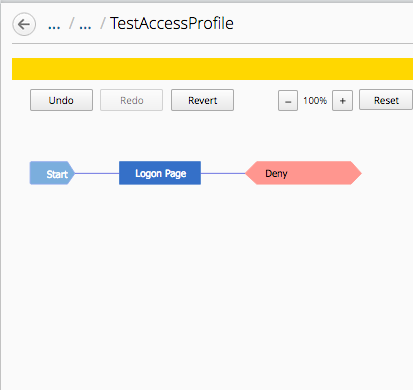

.. |image16| image:: media/image17.png
   :width: 4.93125in
   :height: 3.55955in

.. |image20| image:: media/image21.png
   :width: 6.49097in
   :height: 2.34236in

.. |image23| image:: media/image22.png
   :width: 6.50000in
   :height: 3.45347in
.. |image24| image:: media/image23.png
   :width: 4.68472in
   :height: 3.06735in
.. |image25| image:: media/image24.png
   :width: 3.37361in
   :height: 3.37361in

.. |image27| image:: media/image26.png
   :width: 6.50000in
   :height: 4.65764in
.. |image28| image:: media/image27.png
   :width: 6.50000in
   :height: 3.47222in
.. |image29| image:: media/image28.png
   :width: 6.49097in
   :height: 3.44444in
.. |image30| image:: media/image29.png
   :width: 6.49097in
   :height: 3.41667in
.. |image31| image:: media/image30.png
   :width: 6.48125in
   :height: 3.60208in

.. |image33| image:: media/image32.png
   :width: 6.48125in
   :height: 2.35208in
.. |image34| image:: media/image33.png
   :width: 6.50000in
   :height: 5.18542in
.. |image35| image:: media/image34.png
   :width: 6.49097in
   :height: 3.51875in

.. |image42| image:: media/image41.png
   :width: 6.49097in
   :height: 3.43542in
.. |image43| image:: media/image42.png
   :width: 6.50000in
   :height: 6.32431in
.. |image44| image:: media/image43.png
   :width: 6.50000in
   :height: 1.25278in
.. |image45| image:: media/image44.png
   :width: 1.60397in
   :height: 0.21872in
.. |image46| image:: media/image44.png
   :width: 1.60397in
   :height: 0.21872in
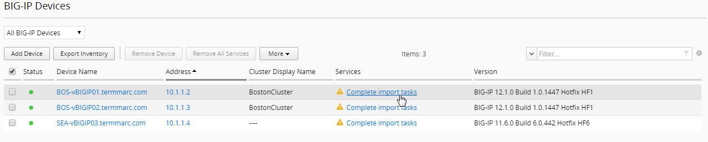
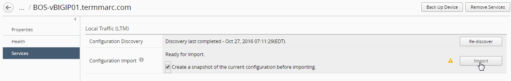
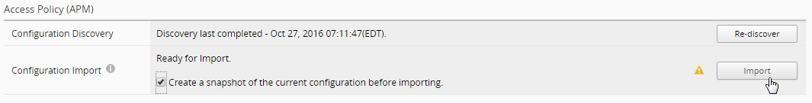
.. |image50| image:: media/image48.png
   :width: 4.93125in
   :height: 1.73045in
.. |image51| image:: media/image49.png
   :width: 6.50000in
   :height: 0.73333in

.. |image53| image:: media/image51.png
   :width: 5.13477in
   :height: 2.15598in
.. |image54| image:: media/image52.png
   :width: 6.50000in
   :height: 0.71667in
.. |image55| image:: media/image53.png
   :width: 6.50000in
   :height: 0.55903in
.. |image56| image:: media/image54.png
   :width: 2.26013in
   :height: 0.93738in
.. |image57| image:: media/image55.png
   :width: 6.50000in
   :height: 1.12500in
.. |image58| image:: media/image54.png
   :width: 2.26013in
   :height: 0.93738in
.. |image59| image:: media/image56.png
   :width: 4.62442in
   :height: 1.35400in
.. |image60| image:: media/image57.png
   :width: 3.92659in
   :height: 1.02071in
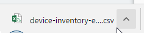
.. |image62| image:: media/image59.png
   :width: 6.50000in
   :height: 1.82639in
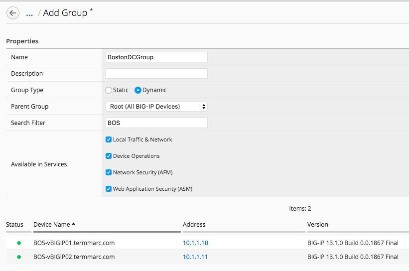
.. |image64| image:: media/image61.png
   :width: 2.28096in
   :height: 1.23943in
.. |image65| image:: media/image62.png
   :width: 6.35479in
   :height: 5.69259in
.. |image66| image:: media/image63.png
   :width: 6.50000in
   :height: 2.21319in
.. |image67| image:: media/image64.png
   :width: 6.49097in
   :height: 4.43542in
.. |image68| image:: media/image65.png
   :width: 1.88518in
   :height: 0.92697in

.. |image70| image:: media/image67.png
   :width: 1.93125in
   :height: 1.26279in
.. |image71| image:: media/image68.png
   :width: 1.93125in
   :height: 1.06679in
.. |image72| image:: media/image69.png
   :width: 6.49097in
   :height: 2.37014in
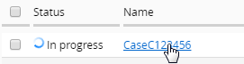
.. |image74| image:: media/image71.png
   :width: 1.93125in
   :height: 1.35353in
.. |image75| image:: media/image72.png
   :width: 6.49097in
   :height: 1.23125in
.. |image76| image:: media/image73.png
   :width: 5.84302in
   :height: 4.64525in
.. |image77| image:: media/image74.png
   :width: 6.50000in
   :height: 2.31250in

.. |image79| image:: media/image76.png
   :width: 6.22917in
   :height: 2.67708in
.. |image80| image:: media/image77.png
   :width: 6.48958in
   :height: 4.21875in
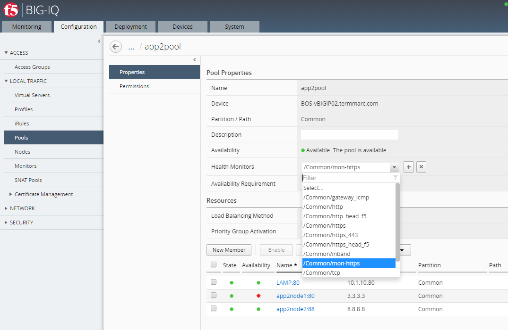

.. |image83| image:: media/image80.png
   :width: 6.50000in
   :height: 4.92361in
.. |image84| image:: media/image81.png
   :width: 6.50000in
   :height: 3.52778in
.. |image85| image:: media/image82.png
   :width: 6.50000in
   :height: 3.52778in

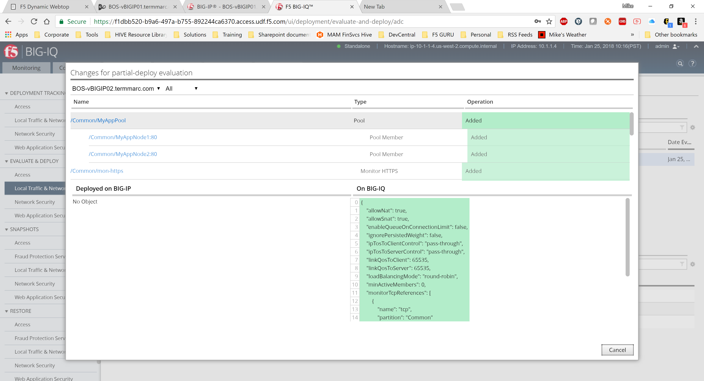
.. |image90| image:: media/image87.png
   :width: 4.70833in
   :height: 1.05460in
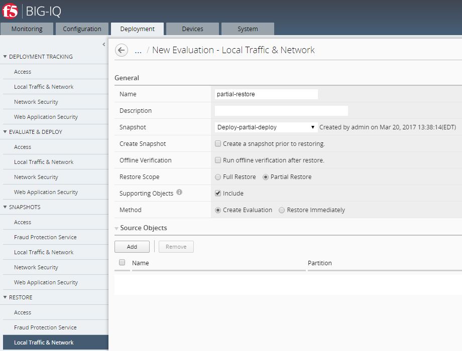
.. |image92| image:: media/image89.png
   :width: 4.22917in
   :height: 2.20722in
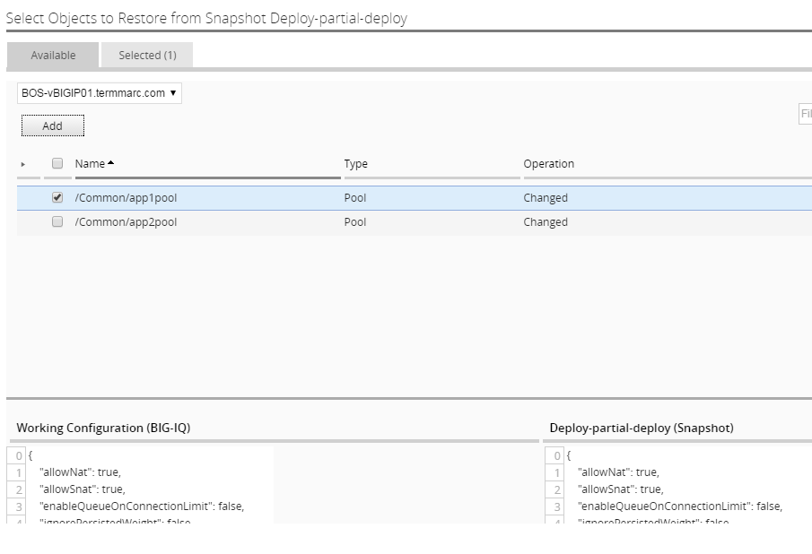
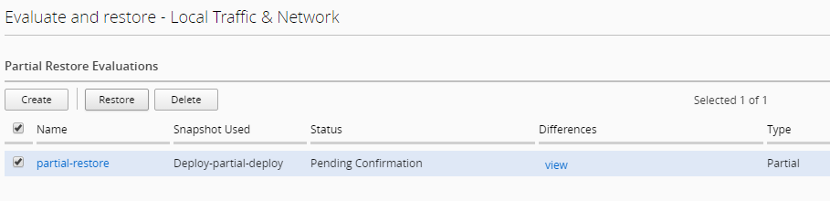
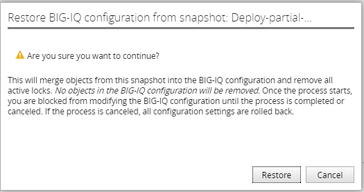
