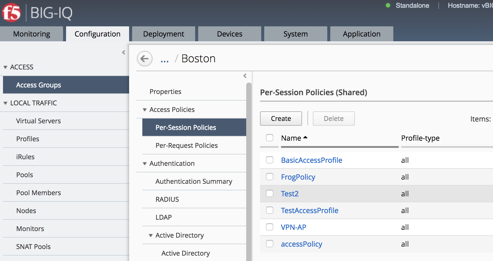

BIG IQ 5.4 Self Guided Lab Guide

Participant Hands-on Lab Guide

Version: 2.0

|image0|

    Last Updated: 3/5/2018

©2018 F5 Networks, Inc. All rights reserved. F5, F5 Networks, and the F5
logo are trademarks of F5 Networks, Inc. in the U.S. and in certain
other countries. Other F5 trademarks are identified at f5.com.

Any other products, services, or company names referenced herein may be
trademarks of their respective owners with no endorsement or
affiliation, express or implied, claimed by F5.

These training materials and documentation are F5 Confidential
Information and are subject to the F5 Networks Reseller Agreement. You
may not share these training materials and documentation with any third
party without the express written permission of F5.

Overview
========

This document details the lab exercises and steps that should be
followed by the student to learn about BIG-IQ Access specific functions
as they relate to managing BIG-IP Access Policy Manager.

The environment is setup with basic configuration and associated traffic
generation to populate dashboards for these exercises. BIG-IQ could be
managing BIG-IPs in Azure and Google Cloud, as well as on premesis for
example. This can be a powerful management tool for customers that are
talking about multi-cloud management.

Introduction

This lab environment is designed to allow for quick and easy
demonstration of a significant portion of the BIG-IQ product. The Linux
box in the environment has multiple cron jobs that are generating
traffic that populates the monitoring tab.

|image1|

Device Information
==================

+------------------------------------------+-------------+--------------------+------------------+---------------------------------------------+
| Device Name                              | Mgmt IP     | Version            | Username/pw      | Provisioning                                |
+==========================================+=============+====================+==================+=============================================+
| BIGIQ\_CM\_5.4                           | 10.1.1.4    | 5.4.0              | admin/admin      | BIG-IQ Console                              |
|                                          |             |                    |                  |                                             |
|                                          |             |                    | root/default     |                                             |
+------------------------------------------+-------------+--------------------+------------------+---------------------------------------------+
| BIGIQ\_DCD\_5.4                          | 10.1.1.6    | 5.4.0              | admin/admin      | BIG-IQ Data Collection Device               |
|                                          |             |                    |                  |                                             |
|                                          |             |                    | root/default     |                                             |
+------------------------------------------+-------------+--------------------+------------------+---------------------------------------------+
| BOS-vBIGIP01.termmarc.com                | 10.1.1.10   | 13.1.0             | admin/admin      | LTM, DNS, ASM, AFM, APM                     |
|                                          |             |                    |                  |                                             |
|                                          |             |                    | root/default     |                                             |
+------------------------------------------+-------------+--------------------+------------------+---------------------------------------------+
| BOS-vBIGIP02.termmarc.com                | 10.1.1.11   | 13.1.0             | admin/admin      | LTM, DNS, ASM, AFM, APM                     |
|                                          |             |                    |                  |                                             |
|                                          |             |                    | root/default     |                                             |
+------------------------------------------+-------------+--------------------+------------------+---------------------------------------------+
| ip-10-1-1-7.us-west-2.compute.internal   | 10.1.1.7    | 12.1.1 HF1         | admin/admin      | LTM, DNS, AFM                               |
|                                          |             |                    |                  |                                             |
|                                          |             |                    | root/default     |                                             |
+------------------------------------------+-------------+--------------------+------------------+---------------------------------------------+
| ip-10-1-1-8.us-west-2.compute.internal   | 10.1.1.8    | 13.1.0             | admin/admin      | LTM, FPS, ASM, APM                          |
|                                          |             |                    |                  |                                             |
|                                          |             |                    | root/default     |                                             |
+------------------------------------------+-------------+--------------------+------------------+---------------------------------------------+
| ip-10-1-1-9.us-west-2.compute.internal   | 10.1.1.9    | 12.1.1 HF1         | admin/admin      | LTM, DNS, AFM                               |
|                                          |             |                    |                  |                                             |
|                                          |             |                    | root/default     |                                             |
+------------------------------------------+-------------+--------------------+------------------+---------------------------------------------+
| Lamp-Server                              | 10.1.1.5    | CentOS 7 (UDF)     | root/default     | App Server, LDAP, Radius, TACACS+, syslog   |
|                                          |             | Ubuntu (Ravello)   |                  |                                             |
|                                          |             |                    | centos/default   |                                             |
+------------------------------------------+-------------+--------------------+------------------+---------------------------------------------+

Dependencies
============

-  The BIG-IP device must be located in your network.

-  The BIG-IP device must be running a compatible software version.

-  Enable basic authentication on BIG-IQ using set-basic-auth on in the
   shell.

**BIG-IP Versions** AskF5 SOL with this info:

https://support.f5.com/kb/en-us/solutions/public/14000/500/sol14592.html

**Note:** Port 22 and 443 must be open to the BIG-IQ management address,
or any alternative IP address used to add the BIG-IP device to the
BIG-IQ inventory.

How to access the lab in the Ravello environment
================================================

**Agility Lab specific instructions.**

For indivual access take the following steps:

**Ravello:**

Once the Instructor has started your Lab environment you will be
provided a URL/IP Address to access the environments Jump Host where you
will perform all the Lab Tasks.

The BIG-IQ User Interface
=========================

In this section, we will go through the main features of the user
interface. Feel free to log into the BIG-IQ device to explore some of
these features in the lab.

After you log into BIG-IQ, you will notice:

1 A navigation tab model at the top of the screen to display each high
   level functional area.

2 A tree based menu on the left-hand side of the screen to display
   low-level functional area for each tab.

3 A large object browsing and editing area on the right-hand side of
   the screen.

|image2|

-  Let us look a little deeper at the different options available in bar
   at the top of the page.

|image3|

-  At the top, each tab describes a high-level functional area for
   BIG-IQ central management:

-  Monitoring –Visibility in dashboard format to monitor performance and
   isolate fault area.

-  Configuration – Provides configuration editors for each module area.

-  Deployment – Provides operational functions around deployment for
   each module area.

-  Devices – Lifecycle management around discovery, licensing and
   software install / upgrade.

-  System – Management and monitoring of BIG-IQ functionality.

-  Application – Visibility for all of the components of the
   application.

-  Overview of left hand navigation for each top-level functional
   area.

|image4|

Note: 
======

This Course is not intended to train you on the general device
management functions of BIG-IQ but rather to train you on the features
available within the Access portion of BIG-IQ for managing BIG-IP Access
Policy Manager module on multiple BIG-IPs throughout your organization.
Therefore we will jump right into the BIG-IQ Access specific related
workflows. Toward the end of the lab we will discuss what steps an Admin
must take in order to discover and import a BIG-IP device running Access
Policy Manager so that it can be managed by BIG-IQ.

.. |image0| image:: media/image1.png
   :width: 1.93958in
   :height: 0.61597in
.. |image1| image:: media/image2.png
   :width: 6.42130in
   :height: 3.98644in
.. |image2| image:: media/image3.tiff
   :width: 6.50000in
   :height: 1.76582in
.. |image3| image:: media/image4.tiff
   :width: 6.50000in
   :height: 2.03056in
.. |image4| image:: media/image5.tiff
   :width: 6.31944in
   :height: 7.85000in

